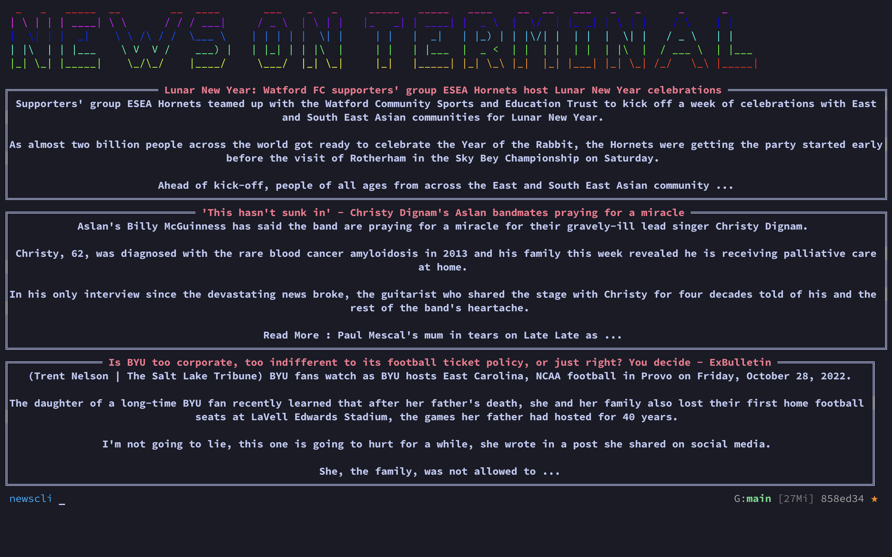

# NEWS ON TERMINAL

News on terminal helps you to get news that you want right on your terminal so that you don't get bored while coding!

## Steps to get the CLI working: 

* Get an api key from [NEWSAPI.AI](https://www.newsapi.ai/)
* make a `.env` file in the root directory
* put api key in the `.env` file with the name "apiKey"
* run `newsfind --help` to get the required options
